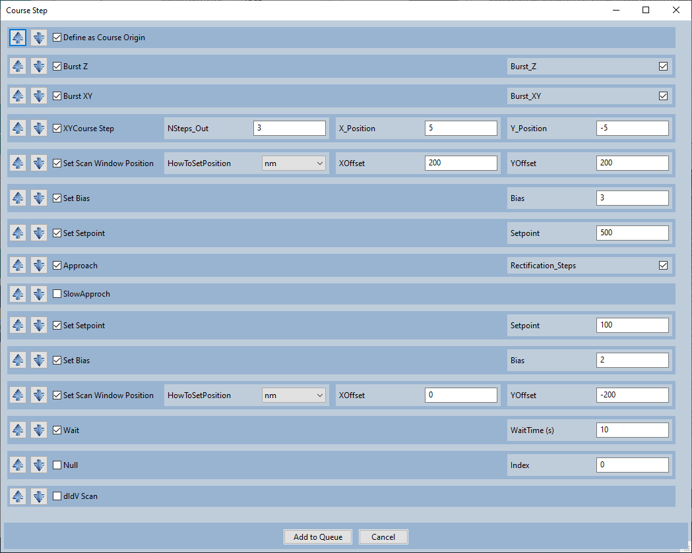
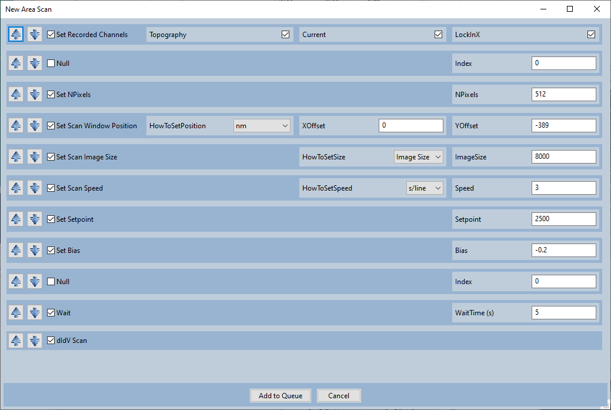

Course Step
==================================================

These are two of the most convenient macros that we use: Course step and New area scan.  
There's nothing special about these macros, you can do the same thing manually or with a python script.  The macros just make it incredibly fast and convenient.

The macro for *Course Steps* consists of the following functions:

    1. Resets the "Course Origin".  

        - XYCourse Step (Function #4) will move to a position relative to the Course Origin.

    2. Burst Z
    
        - Sets Burst Z to True so course steps will use CreaTec's 'bursts' instead of individual steps.

    3. Burst XY
    
        - Sets Burst XY to True so course steps will use CreaTec's 'bursts' instead of individual steps.

    4. Set Scan Window position

        - Moves the tip to near the bottom right corner of the DSP window.  Just in case the tip leaves a crater apon approach, the crater will be out of the way.

    5. Set Bias

        - Sets a somewhat large bias to make crashes and false approaches less likely.  

    6. Set Setpoint

        - Sets a somewhat large setpoint to prevent false approaches from a capactive signal.

    7. Approach

        - Calls CreaTec's approach function

    8. Set Setpoint

        - Returns to a standard setpoint

    9. Set Bias

        - Returns to a standard bias

    10. Set Scan Window Position

        - Returns the tip to the center of the DSP window.

    11. Wait

        - Does nothing for 10 seconds to wait for the piezo creep to go away.

The macro for a *New area scan* consists of the following functions:

    1. Set Recorded Channels

        - Sets the topography, current, and dI/dV channel to be recorded.

    2. Set NPixels

        - Sets the number of pixels in an image to be 512x512

    3. Set Scan Window Position

        - Moves the tip to the top of the DSP window.

    4. Set Image Scan Size

        - Sets the scan size to be the full range of the DSP window.

    5. Set Scan Speed

        - Sets the scan speed to be somewhat slow (in terms of s/lines) because it'll be scanning a large area.

    6. Set Setpoint

        - Sets a reasonable setpoint (The default setpoint is changed depending on the material; 2500pA is for Ni(111))

    7. Set Bias

        - Sets a reasonable bias (The default bias is changed depending on the material; -0.2V is for Ni(111))

    8. Wait

    9. dI/dV Scan 

