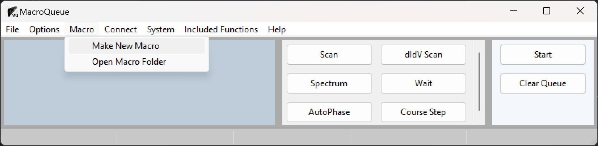
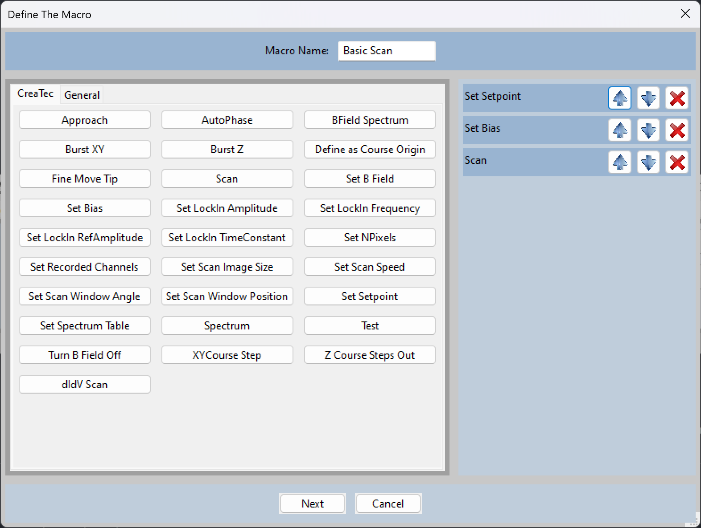
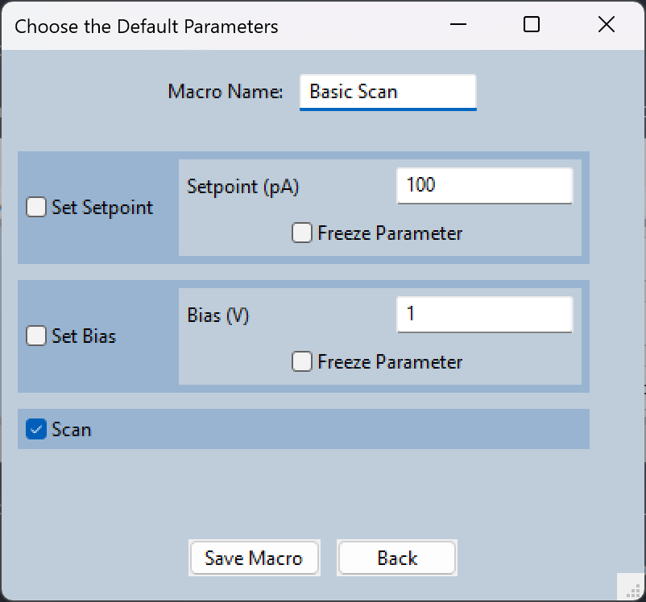

Defining a Macro
=================================================

- Go to Macro -> Make New Macro

    - Or right click an existing macro, and choose Edit from the menu.

- Choose the functions that you would like to be in the macro.

    - You may change the order or remove a function in the macro in the panel on the right.

- Choose a name for your macro.  

    - If it's a pre-existing macro and you do not change the name, the original macro will be overwriten.

- Press 'Next' to choose the default parameters of your macro.

- Each function has a checkbox that indicates whether the function will run by default in the macro.  Refer to :doc:`../AddToQueue` for additional information.

    - You may uncheck the box if you do not want the function to be included by default.  This is useful for functions that you want to occasionally use in the macro.

- You may choose the default value for each parameter of each function. 

- You may choose to freeze the parameter.  

    - This will remove the option to change the parameter when adding it to the queue.  It simplifies the macro in exchange for less control.

