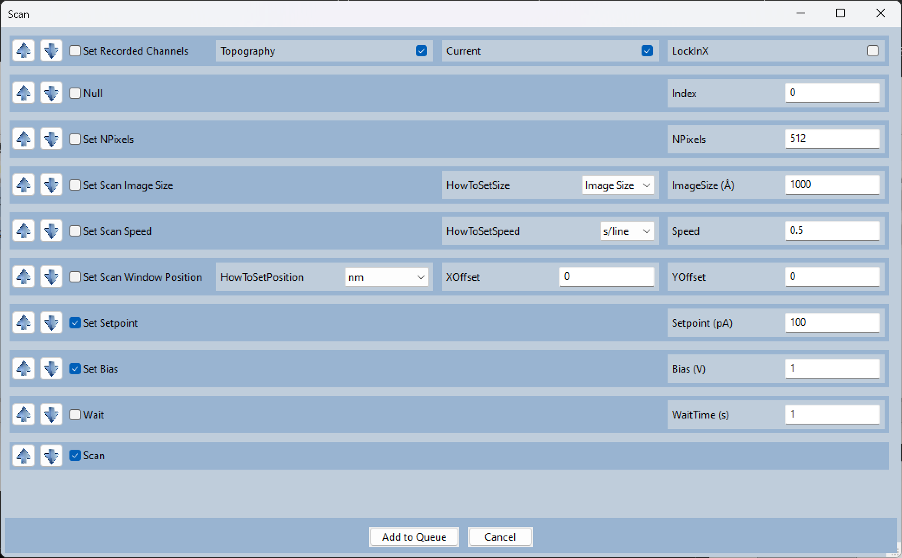
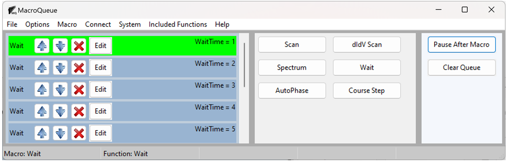
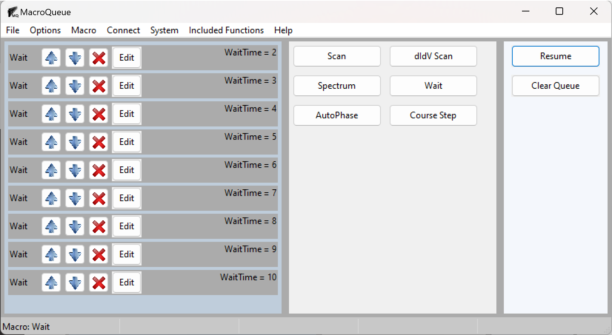
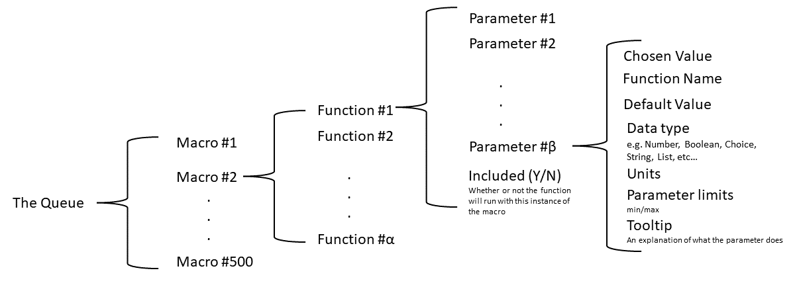

Introduction
==================================================

*MacroQueue*'s user interface has 3 sections: the Queue, the Macros, and the control buttons. There are also the menus and status bar.

.. image:: ./GUI.png

Left clicking on one of the macros will bring up a dialog asking for the parameters so you can :doc:`AddToQueue`.

.. image:: ./MacroImage.png

Once a macro is in the queue, you can right click on it to copy, edit, delete, or move.

.. image:: ./QueueImage.png

Once you start the queue, by pressing the button on the left, the button will turn into a "Pause after Macro" button. 

Structure
---------------------

The queue is a global variable defined at the top of the MacroQueue class in MacroQueue.py::

        TheQueue = []

The queue is a list of macros; each Macro is a list of functions; each function is a list of parameter data.

Here is the complete structure:

For concrete example, see :doc:`CourseStep`.