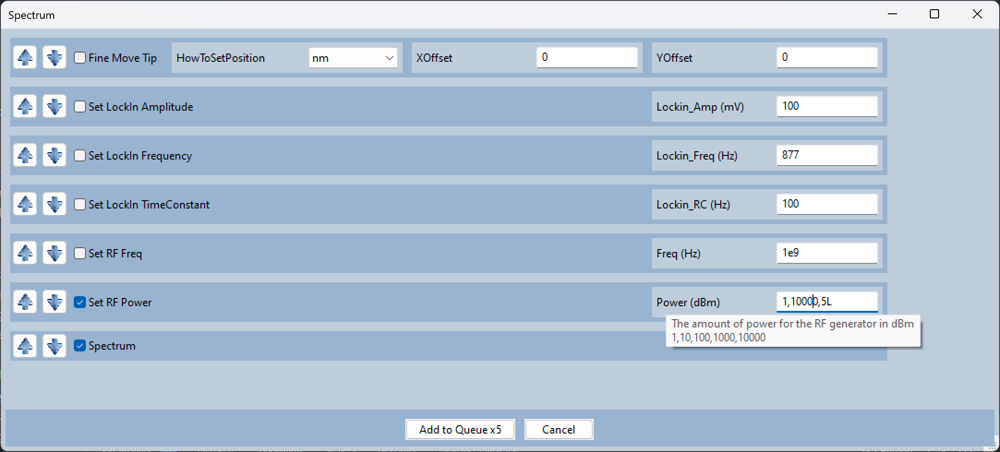
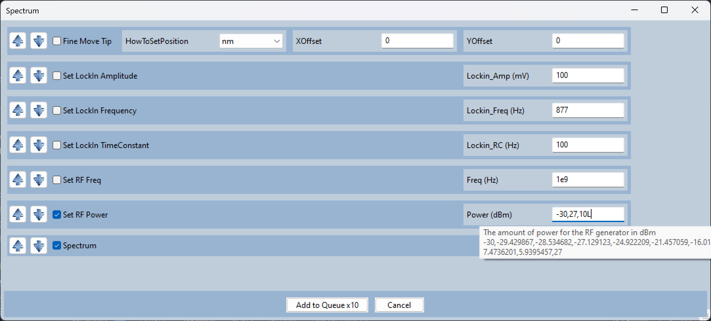

Logarithmically Spaced Parameters
==================================================

You can expand on a logscale by placing an 'L' or 'l' at the end.

This is useful if you have an instrument, like an RF generator, that uses logarithmic units (dBm).

The format is '{Start}, {End}, {N Points}L'.   

e.g. 1,10000,5L is equivalent to 1,10,100,1000,10000.

Start and End can be any number.  It doesn't have to evenly go into integers:

