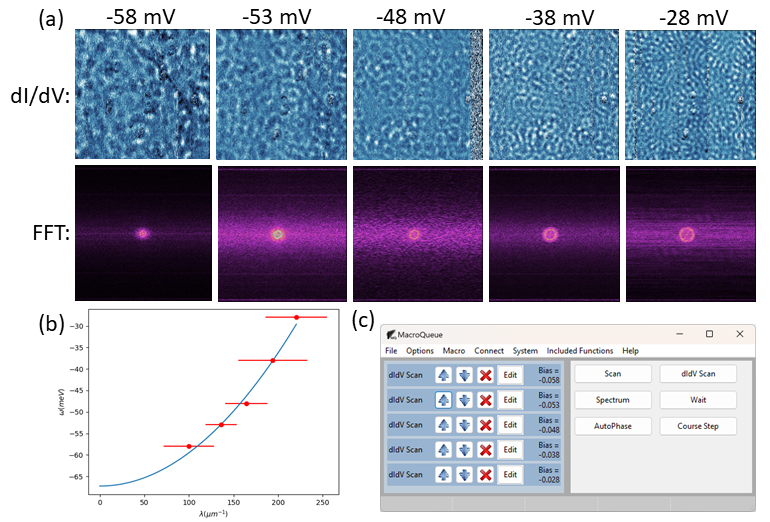

Quasiparticle Interference (QPI) Mapping
==================================================

`QPI Mapping <https://www.nature.com/articles/363524a0>`_ is well established technique to study the low-energy electronic structure of a structure, more specifically, it's a techique to measure a matieral's band stucture, ω(k)

It is done by taking several dI/dV images at different biases and taking their fast fourier transform (FFT), shown in Figure (a).  The halo in reciprocal space corresponds to the band's wavelength at this particular energy, plotted in Figure (b).

This measurement takes over an hour for each image.  MacroQueue allows you to take all the images consecutively without additional human input, shown in Figure (c).

