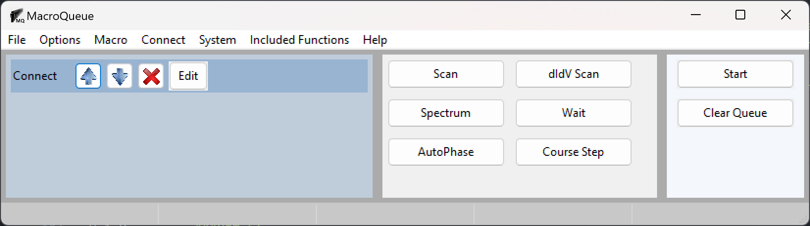
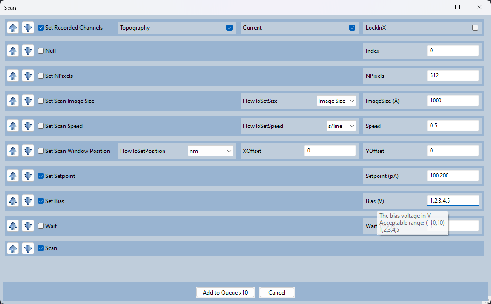

.. MacroQueue documentation master file, created by
   sphinx-quickstart on Fri Mar 15 11:33:35 2024.
   You can adapt this file completely to your liking, but it should at least
   contain the root `toctree` directive.

MacroQueue's Documentation
======================================

Scanning Probe Microscopy operators often use several different instruments for a single measurement; such as, an external lock-in amplifer, an electromagnet, a RF generator, etc..  Often, these intruments have to be manually controlled and then their parameters have to be manually recorded.  MacroQueue is a modular software designed for controlling and automating SPM systems and various other laboratory equipment in sync.  It provides a single GUI to control the 3 major commerical SPMs, CreaTec, RHK, and Scienta Omicron in combination with any other instruments that are apart of the systems.  

Users can easily add python functions to control new and existing equipment.  Although any arbitary python function can be added, the base functions were created with the functional programming paradigm in mind, so the functions are small and each perform a single task.  For example, the function "Set RF Frequency", changes the frequency on the RF generator and records the new value.  This allows the functions to be reused for many types of measurements.

The functions are grouped into a macro for each type of measurement.  Macros are added to a queue with different values for each parameter (e.g. bias, magnetic field, etc.) to perform measurements throughout a parameter space.  Each measurement is performed consecutively on a seperate thread to enable measurements in the queue to be modified.
These features allow users to easily control several instruments in sync, perform a long series of measurements with minimal input, and add new instruments to a system. 

.. toctree::
   :maxdepth: 1
   :caption: Contents:

   Install
   Tutorials/Tutorial
   Contributing

License
----------

The project is licensed under the MIT license.

Acknowledgements
--------------------

*MacroQueue* was built by Brad Goff as part of the Gupta Group in the physics department at The Ohio State University.  Visit our group's website here: https://u.osu.edu/guptagroup/.

This work was primarily supported by the Department of Energy (DOE) Basic Energy Sciences under Grant No. DE-SC0016379.
